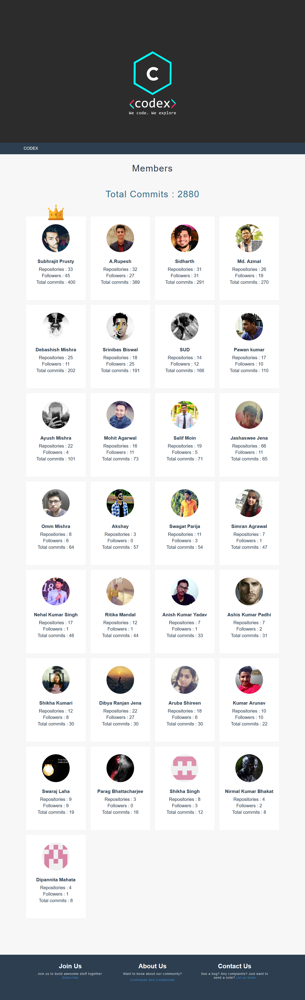

# codex-github 
Contributions of Codex members on Github 

# Resources Used

# Build and Deploy

## API Setup

- Create an OAuth app on Github
- Set environment value `CLIENT_ID` as the `client_id` of the OAuth app
- Set environment value `CLIENT_SECRET` as the `client_secret` of the OAuth app

## Database Setup

- Create a MongoDB server. I've used [MLab](https://www.mlab.com/)
- Set environment value `MONGODB_URI` to the MongoDB server url
- Create a collection `members`

## Members setup

- Add the members you want to show in [users.json](./static/users.json)
- Run `python update.py`
- Wait for it to populate the database

## Run the app and deploy

- Install all dependencies `pip install -r requirements.txt`
- Run `python app.py`
- Browse to `localhost:5000`
- Deploy to your preferred platform. I've used heroku.

## Updating and maintainance

- Create a scheduler to run `python update.py` every hour. (If it is run more than once an hour, you can get rate limited)
- Everytime you add a new name to the list, it is safer to manually run `python update.py` \
  rather than wait for it to update at the next schedule

# Members

| Name | Github Username |
|:------|:---------------:|
| Subham Sagar Paira | [subhamsagar524](https://github.com/subhamsagar524)
| Kreeti Singh | [Kreetisingh](https://github.com/Kreetisingh)
| Subham Sinha | [sinhasubham](https://github.com/sinhasubham)
| Sachiket Behera | [sachiket](https://github.com/sachiket)
| Ritika Mandal | [Ritika432](https://github.com/Ritika432)
| Akshay | [akki031197](https://github.com/akki031197)
| Jashaswee Jena| [jashasweejena](https://github.com/jashasweejena)
| Salif Moin | [salif-04](https://github.com/salif-04)
| Parag Bhattacharjee | [PsychoBoy5](https://github.com/PsychoBoy5)
| Nehal Kumar Singh | [geekyNehal](https://github.com/geekyNehal)
| Omm Mishra | [ommmishra](https://github.com/ommmishra)
| Simran Agrawal | [SimranAgrawal1](https://github.com/SimranAgrawal1)
| Shikha Kumari | [shikhanimmi](https://github.com/shikhanimmi)
| Kumar Arunav | [KumarArunav](https://github.com/KumarArunav)
| Dipannita Mahata | [dipu-m18](https://github.com/dipu-m18)
| Shikha Singh | [SHIKHASINGH1506](https://github.com/SHIKHASINGH1506)
| Anish Kumar Yadav | [anish-yadav](https://github.com/anish-yadav)
| Swagat Parija | [swagat5147](https://github.com/swagat5147)
| Mohit Agarwal | [mojito9542](https://github.com/mojito9542)
| MD Azmal | [MD-AZMAL](https://github.com/MD-AZMAL)
| Ankit Prasad | [Ankit289Prasad](https://github.com/Ankit289Prasad)
| Aruba Shireen | [aruba246](https://github.com/aruba246)
| Ashis Padhi |	[AshisPadhi](https://github.com/AshisPadhi)
| Pawan Kumar | [Pawan0411](https://github.com/Pawan0411)
| Debashish Mishra | [Zanark](https://github.com/Zanark)
| A Rupesh | [rupesh1310](https://github.com/rupesh1310)
| Nirmal Kumar Bhakat | [Nirmal-Kr](https://github.com/Nirmal-Kr)
| Subhrajit Prusty | [SubhrajitPrusty](https://github.com/SubhrajitPrusty)
| Dibya Ranjan Jena | [dibyasonu](https://github.com/dibyasonu)
| Sudhansu | [alphacrash](https://github.com/alphacrash)
| Swaraj Laha | [swarajlaha](https://github.com/swarajlaha)
| Srinibas Biswal | [srinibasbiswal](https://github.com/srinibasbiswal)
| Sidharth | [xlreon](https://github.com/xlreon)
| Ayush Mishra | [hsuay](https://github.com/hsuay)
| Subhasish Sahu | [subhasish210](https://github.com/subhasish210)

# Screenshots

